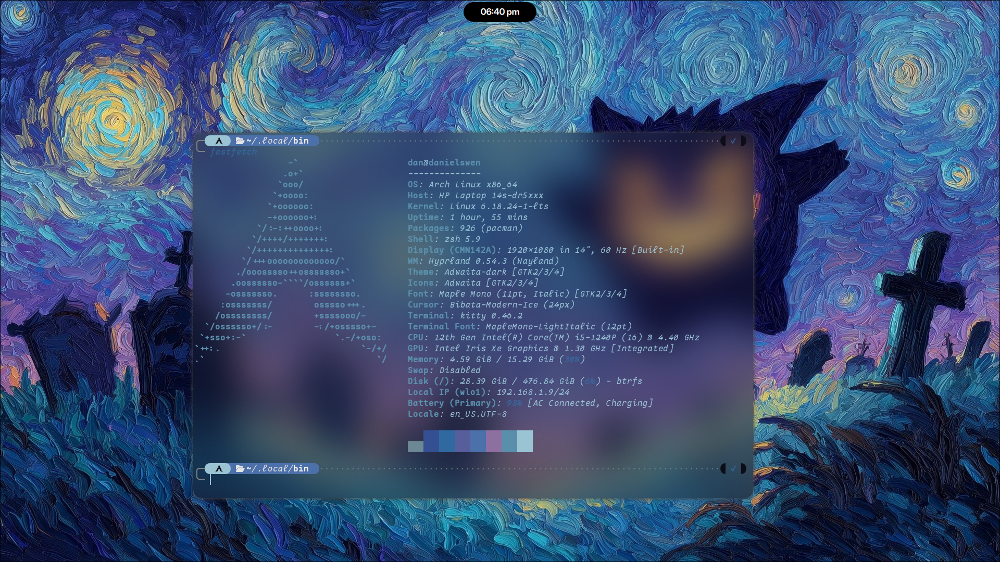
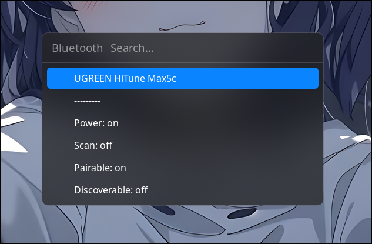
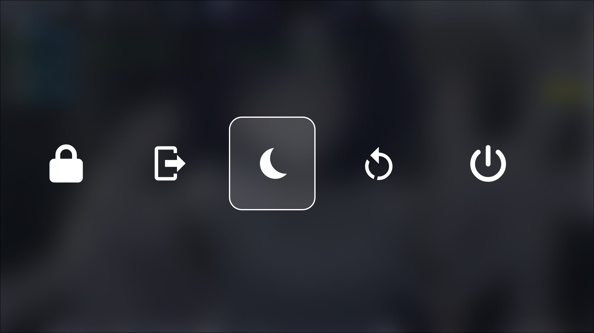
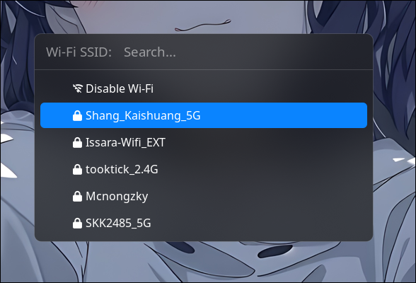

# Swen's Hyprland Dotfiles

> ⚠️ I do not recommend copying this repository directly.
> Please review and adapt the configuration to fit your own system to avoid potential issues.

---


<div align="left">
  
</div>

##  Structure

This repository is divided into **4 main parts**:

---

###  bin

####  Location

```bash
~/.local/bin/
```

####  Contents

* Bluetooth menu
<div align="left">
  
</div>

* Power menu
<div align="left">
  
</div>

* Wallpaper switcher
<div align="left">
  
</div>

* Wi-Fi menu
<div align="left">
  
</div>


> If you want to use the wallpaper switcher, place your wallpapers in:

```bash
~/Pictures
```

> ⚠️ All scripts in this section require **rofi**.

---

###  hypr

####  Location

```bash
~/.config/hypr/
```

####  Contents

* Hyprland configuration
* Hypridle configuration
* Hyprlock configuration
* Hyprpaper configuration
* Scripts (currently only `music_info.sh`)

##### Animation be like:
<div align="left">
  
</div>

> ⚠️ Place the scripts in:

```bash
~/.config/hypr/Spris
```

---

### rofi

####  Location

```bash
~/.config/rofi/
```

####  Contents

* Default rofi config (`config.rasi`) — used for Wi-Fi / Bluetooth menus
* App launcher config (`config_app_launcher.rasi`)
* Wallpaper switcher config (`wallpaper_switcher.rasi`)

---

###  Dynamic Island

For the Dynamic Island implementation, check here:
👉 https://github.com/enhaoswen/Tide-island

---

##  Acknowledgments

This project is built on ideas and scripts from various sources.
Since it has been a long time, I may not remember all of them, but I would like to thank all the original contributors.

---

##  Notes

* This setup is tailored to my personal workflow
* Some paths and behaviors may need adjustments on your system
* Use at your own discretion
